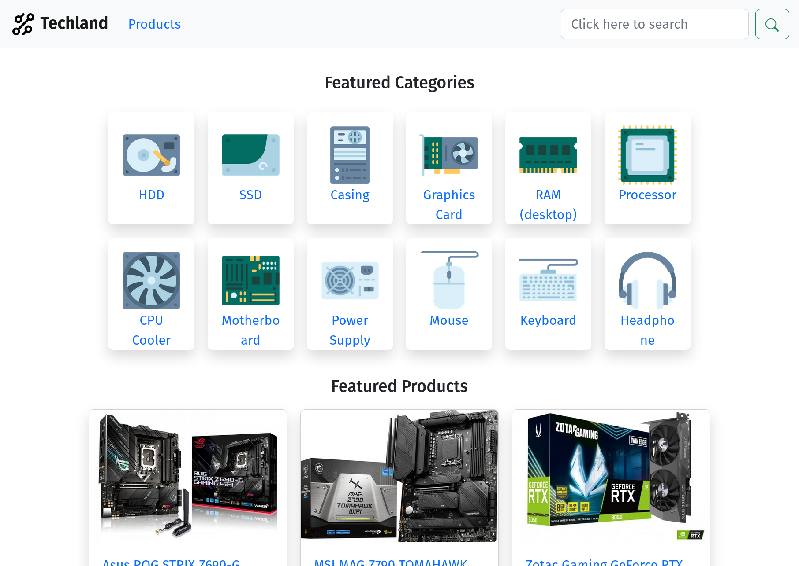
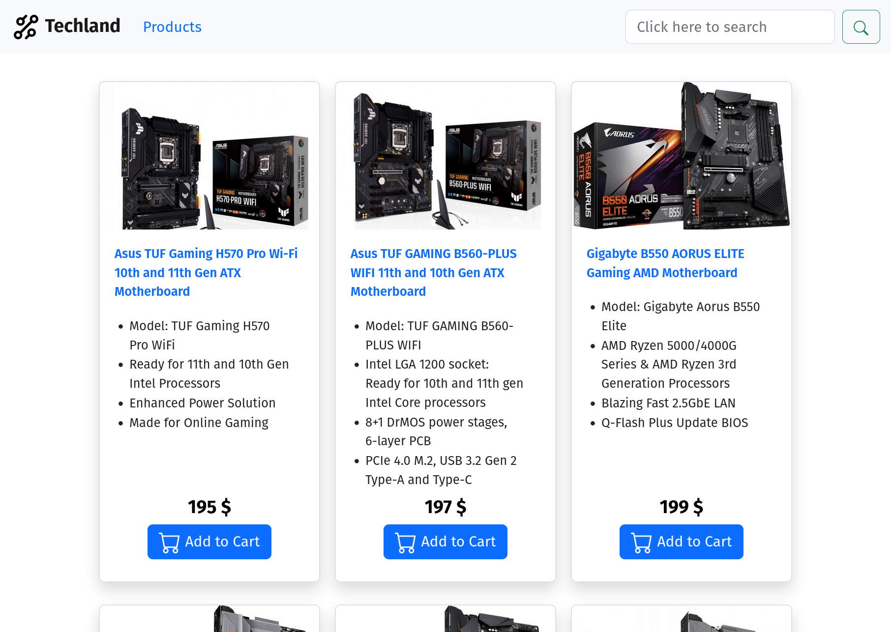
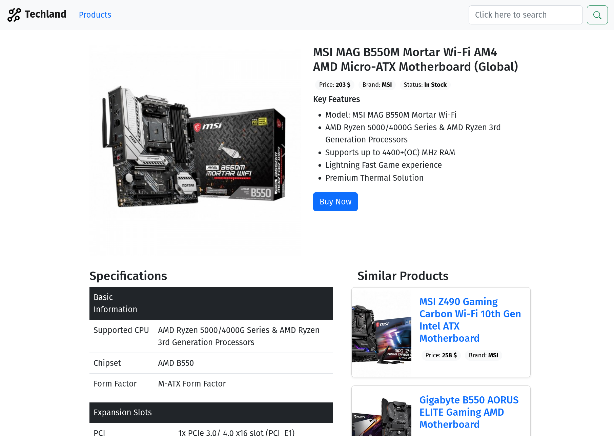
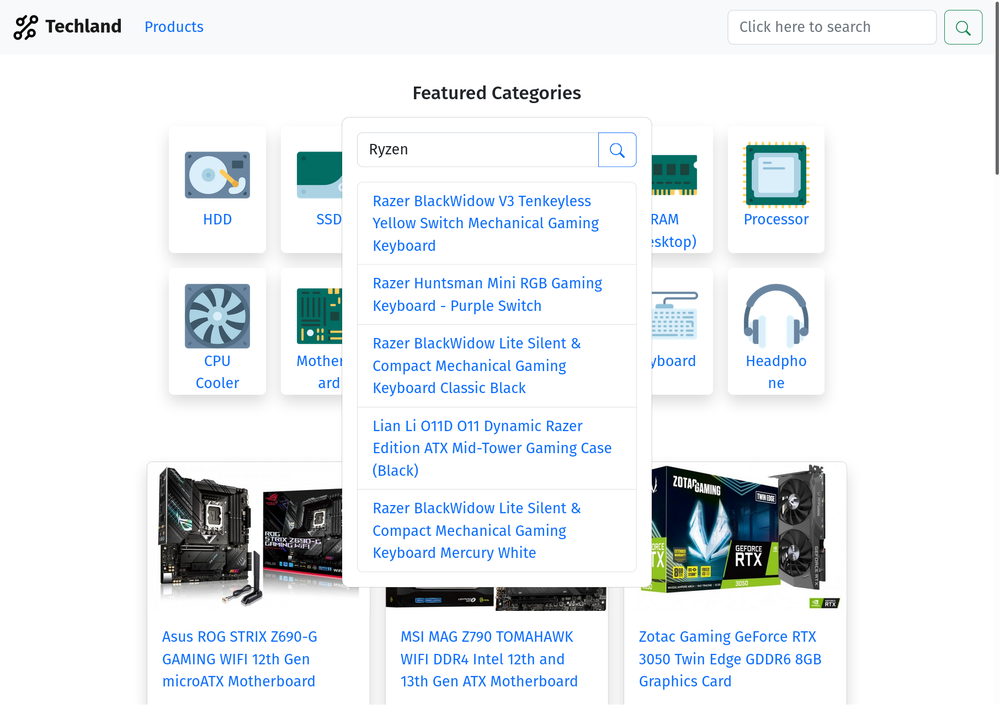

# Techland Frontend

The frontend of my e-commerce app techland. This was my submission for
MongoDB Atlas Hackathon 2022 on DEV. The app is still work in progress.

## Tech Stack

- React
- Bootstrap

## Credits

The category icons are taken from
[FlatIcons](https://www.flaticon.com/authors/juicy-fish)

## Screenshots

### Homepage

### Products Page

### Individual Products Page

### Search Modal

